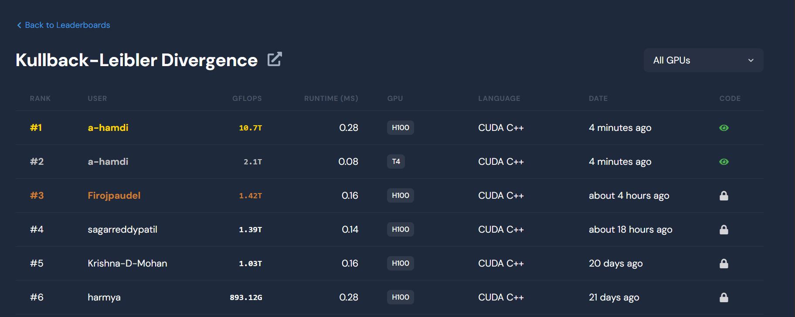

# GPU 100 days Learning Journey

This document serves as a log of the progress and knowledge I gained while working on GPU programming and studying the **PMPP (Parallel Programming and Optimization)** book.

Mentor: https://github.com/hkproj/

Bro in the 100 days challenge: https://github.com/1y33/100Days

Check out my blog: https://hamdi.bearblog.dev/

---

## Day 1
### File: `vectadd.cu`
**Summary:**  
Implemented vector addition by writing a simple CUDA program. Explored how to launch a kernel to perform a parallelized addition of two arrays, where each thread computes the sum of a pair of values.  

**Learned:**  
- Basics of writing a CUDA kernel.
- Understanding of grid, block, and thread hierarchy in CUDA.  
- How to allocate and manage device (GPU) memory using `cudaMalloc`, `cudaMemcpy`, and `cudaFree`.  

### Reading:  
- Read **Chapter 1** of the PMPP book.  
  - Learned about the fundamentals of parallel programming, CUDA architecture, and the GPU execution model.

---

## Day 2
### File: `MatrixAdd.cu`
**Summary:**  
Worked on matrix addition using CUDA. Designed the grid and block layout to handle 2D matrices in parallel, with each element processed by an individual thread.  

**Learned:**  
- How to map 2D matrix data onto multiple threads.
- Understanding thread indexing in 2D grids and blocks using `threadIdx`, `blockIdx`, `blockDim`, and `gridDim`.  
- Synchronizing threads and avoiding race conditions when writing results to an output matrix.  

### Reading:  
- Read **Chapter 2** of the PMPP book.  
  - Learned about scalability of GPUs, massive parallelism, and how to configure problem data to match GPU thread hierarchies.  

---

## Day 3
### File: `Matrix_vec_mult.cu`
**Summary:**  
Implemented matrix-vector multiplication using CUDA. Each thread was set up to compute the dot product between a matrix row and the given vector. Optimized performance using shared memory.  

**Learned:**  
- How to perform dot products in parallel.
- Efficiently handling shared memory to avoid excessive global memory accesses and improve memory coalescing.
- Launching kernels for 1D or 2D thread configurations based on input data.  

### Reading:  
- Read **half of Chapter 3** of the PMPP book.  
 -Learned about Scalable Parallel Execution.

---

## Day 4
### File: `PartialSum.cu`
**Summary:**  
Worked on parallel reduction to compute the partial sum of an array. Implemented a tree-based reduction algorithm, minimizing warp divergence for better performance.  

**Learned:**  
- The concept of reduction in parallel programming.
- Techniques for minimizing warp divergence and balancing workload across threads.
- How to use shared memory effectively in reduction operations.  

### Reading:  
- Finished **Chapter 3** of the PMPP book.  
  - Learned about Scalable Parallel Execution including Resource Assignment and Thread Scheduling and Latency Tolerance

---

## Day 5
### File: `LayerNorm.cu`
**Summary:**  
Implemented Layer Normalization in CUDA, often used in deep learning models. Explored normalization techniques across batches and layers using reduction operations. Addressed the challenge of maintaining numerical stability during computation.  

**Learned:**  
- How to calculate mean and variance in parallel using reduction algorithms.
- Strategies to stabilize floating-point operations to prevent overflow or underflow issues.
- CUDA kernel optimization for workloads involving tensor computation.  

### Reading:  
- Read **Chapter 4** of the PMPP book.  
  -  Learned about memory optimizations and strategies for GPU performance tuning.

---

## Day 6
### File: `MatrixTranspose.cu`
**Summary:**  
Implemented CUDA-based matrix transposition. Optimized the implementation by leveraging shared memory to minimize global memory reads and writes. Ensured proper handling of edge cases when the matrix dimensions are not multiples of the block size.  

**Learned:**  
- How to optimize memory usage when working with global and shared memory.  
- Techniques to handle data alignment and padding for non-square matrices during transposition.  
- The importance of coalescing memory accesses in CUDA to improve performance.  

### Reading:  
- Read **Chapter 5** of the PMPP book.  
  - Learned about Performance Considerations including optimizing memory access patterns, advanced use of shared memory for performance and dynamic Partitioning of Resources .  
- Read **Chapter 6** of the PMPP book.  
  - Learned about Numerical Considerations including IEEE Format, Arithmetic Accuracy and Rounding and Linear Solvers and Numerical Stability. 

## Day 7

### File: `one_d_convolution.cu`
**Summary:**  
Implemented a simple 1D convolution algorithm using CUDA. This involved sliding a kernel (or filter) over an input array and computing the weighted sum of elements. Each thread was assigned to compute the convolution at a specific position in the output array.  

**Learned:**  
- Basics of 1D convolution in parallel, including mapping threads to positions in the output array.
- How to handle boundary conditions (halo cells) when the kernel partially overlaps the input array bounds.
- Importance of memory layout and contiguous access for kernel weights and input arrays to maximize performance.

---

### File: `one_d_convolution_with_tiling.cu`
**Summary:**  
Implemented an optimized version of the 1D convolution algorithm using tiling and shared memory. Divided the input array into tiles and loaded data into shared memory, minimizing global memory accesses for better performance. Used halo cells to handle edge cases where kernel overlap extended into neighboring tiles.  

**Learned:**  
- Tiling in CUDA: Dividing input data into manageable chunks and leveraging shared memory to reduce global memory latency.
- Use of **halo cells** to ensure correctness at tile boundaries during convolution.
- How to balance computation and memory usage in tiled algorithms to improve performance.
- Proper synchronization of threads within a block (using `__syncthreads()`) to ensure data consistency in shared memory.

---
### File: `2d_convolution_with_tiling.cu`  
**Summary:**  
Implemented a 2D convolution algorithm with tiling optimization using CUDA. Divided the input matrix into tiles and leveraged shared memory to minimize global memory accesses, ensuring efficient computation of the convolution kernel across the matrix. Handled boundary conditions using halo cells to process edges and corners correctly.  

**Learned:**  
- Extended tiling techniques from 1D to 2D data structures for efficient parallel computation.  
- Optimized global memory access by using shared memory for each tile.  
- Synchronization of threads for consistent shared memory usage within a block (`__syncthreads()` for proper execution order).  
- Efficient handling of edge cases and boundary cells in 2D convolution.  

--- 

### Reading:  
- Read **Chapter 7** of the PMPP book.  
  - Learned about parallel patterns for convolution, including basic algorithms, memory optimizations with constant and shared memory, and tiling techniques with halo cells for 1D and 2D convolution.

## Day 8  
### File: `prefixsum_brent_kung_algorithm.cu`  
**Summary:**  
Implemented the Brent-Kung algorithm for parallel prefix sum (scan) in CUDA, designing a work-efficient strategy to compute prefix sums across an array.  

**Learned:**  
- The fundamentals of hierarchical parallel scan algorithms and the Brent-Kung approach for work efficiency.
- How to divide the scan operation into an **up-sweep (reduce)** phase and a **down-sweep** phase using shared memory for efficient computation.  
- Optimized thread synchronization and memory usage for large input arrays.  

### Reading:  
- Read **Chapter 8** of the PMPP book.  
  - Learned about different parallel patterns for prefix sum computation, focusing on performance, memory access efficiency, and work-efficient algorithms like hierarchical scans.  
- Read **Chapter 9** of the PMPP book.  
  - Learned about different parallel patterns for Parallel Histogram Computation, focusing on Atomic Operations,  Interleaved Partitioning, Privatization and Aggregation.  

### Day 9  

### File: `flash_attention_forward.cu`  
**Summary:**  
Implemented a forward pass for Flash Attention in CUDA, based on the Flash Attention paper. The code is still a work in progress and might produce incorrect results. A refined and fully functional version will be updated in the coming days.  

**Learned:**  
- Explored the fundamentals of Flash Attention, including its memory-efficient mechanism for attention computation.  
- Gained insights into optimizing CUDA kernels for operations like softmax and scaling factors used in attention.  
- Identified potential challenges in achieving numerical stability and correctness when implementing complex attention mechanisms.  

### Reading:  
- Read the **Flash Attention paper**.  
  - Learned about the key concepts of reducing memory overhead in attention computation, streamlining the matrix multiplication process, and ensuring efficient scaling for large models.

### Day 10:
### File: `flash_attention_forward.cu` 
Optimized and corrected yesterday's forward pass for Flash Attention in CUDA, based on the Flash Attention paper. The code is still a work in progress!

### File: `torch_test.py` 
Torch code to check the results of flash_attention_forward kernel.

### Blog: `Understanding Flash Attention (Forward) with CUDA`
A blog on flash attention (forward algorithm) explaining the parts of my code. I'll try to make it more intuitive with drawings as soon as I have time.

### Day 11
### File: `sparse_MatrixVecMult_Hybrid_ELL_COO.cu`
**Summary:**  
Completed the implementation of a highly optimized sparse matrix-vector multiplication (SpMV) algorithm using a hybrid approach that combines ELL (Ellpack) and COO (Coordinate) formats. This implementation focuses on minimizing memory overhead while maximizing computational efficiency across the sparsity of the input matrix.

**Learned:**  
- Explored the principles and benefits of different sparse matrix representations, namely ELL and COO formats.
- Implemented hybrid techniques to optimize performance by balancing memory access patterns and ensuring efficient data locality.
- Benchmarked the performance of the CUDA implementation against PyTorch to evaluate the efficiency and correctness of the optimized SpMV algorithm.

### Reading:  
- Completed **Chapter 10** of the PMPP book.  
  - Gained insights into parallel patterns for sparse matrix computations, focusing on the background of sparse data handling, parallel SpMV using CSR formats, and padding and transposition techniques for optimization.  
  - Learned about utilizing hybrid approaches to manage padding effectively and methods for sorting and partitioning to enhance regularization in sparse data.

### File: `benchmark.py`
**Summary:**  
Developed a benchmarking script to evaluate the performance of the custom CUDA SpMV implementation against PyTorch's built-in functions. This benchmark facilitates comparative analysis of execution times and ensures that the implementation meets expected performance standards.

### Blog:  
- Wrote a blog post titled **"Learning CUDA with a Weak GPU or No GPU at All: Yes, You Can!"**  
  - Addressed common misconceptions regarding GPU programming and provided practical tips for learners with limited hardware resources. The blog offers insights on optimizing CPU-based implementations and highlights methods to learn CUDA fundamentals without direct access to a powerful GPU.

**Link to Blog:**  
[Learning CUDA with a Weak GPU or No GPU at All: Yes, You Can!](https://hamdi.bearblog.dev/learning-cuda-with-a-weak-gpu-or-no-gpu-at-all-yes-you-can/)

## Day 12
### File: `merge_sort.cu`
**Summary:**  
Implemented the Merge Sort algorithm using CUDA. The implementation focuses on merging two sorted arrays into a single sorted array using a parallel approach. The kernel utilizes a co-rank function to find positions in the combined array for inserting elements from the two sorted input arrays efficiently.  

**Learned:**  
- Explored the fundamentals of merge sort and its parallelization strategies.
- Implemented the co-rank function which assists in finding the correct position of elements while merging two sorted arrays.
- Developed a parallel merge kernel that utilizes the GPU's capabilities for concurrent execution, enhancing performance beyond a sequential merge approach.

### Reading:
- Read **Chapter 11** of the PMPP book.  
  - Covered various aspects of merge sort parallel pattern. Key sections included:
    - **Background**: Understanding the merge sort algorithm and its significance in parallel processing.
    - **Sequential Merge Algorithm**: Key insights into how merge operations are typically conducted sequentially.
    - **Parallelization Approach**: Strategies for achieving parallelism in merge sort, highlighting the expected performance benefits.
    - **Co-Rank Function Implementation**: Understanding how the co-rank function is used to determine merging positions effectively.
    - **Basic and Tiled Merge Kernel**: Learning about different kernel designs including basic parallel merge kernels and more advanced tiled merge techniques for optimizing data access patterns.

## Day 13
I coded a Breadth first search optimized kernel, check this for more details: [BFS](./day%2013/Bfs/README.md) .

I also coded  Gelu activation kernel, check this for more details: [Gelu](./day%2013/Gelu/README.md) .

And also coded a full linear layer that treats batches using cublas: [Linear_kernel](./day%2013/Glu/README.md) .

---

### Reading:
- Read **Chapter 12** of the PMPP book.  
  - Explored parallel patterns for graph searches, covering:
    - Background on graph structures and traversal mechanisms.
    - Detailed sections on implementing both sequential and parallel BFS functions.
    - Insights into optimizing graph traversal performance, including memory bandwidth considerations and load balancing strategies in parallel algorithms.
- Read **Chapter 13** of the PMPP book.
  - Learned about the fundamentals of CUDA Dynamic Parallelism, including:
    - The basics and overview of dynamic parallelism in CUDA.
    - How memory visibility works, especially in the context of different memory types (global, shared, local).
    - Memory management strategies and the impact of nesting depth on kernel launches.
    - Synchronization techniques, streams, and events for managing concurrent operations within dynamic kernels.
    - Studied a more complex example about Bezier curve calculations both with and without dynamic parallelism, enhancing my understanding of recursive  
---

### Future Plans:
- Optimize the BFS implementation using hierarchical queues for better memory usage and performance.
- Explore additional enhancements and optimizations discussed in Chapter 12 to refine the BFS algorithm further.
- Prepare a performance comparison between CPU and GPU implementations in the subsequent days.

## Day 14

### File: `cmpFHD.cu`
**Summary:**  
Implemented the FHD (Fully-Hybrid Domain) algorithm for non-Cartesian magnetic resonance imaging (MRI) reconstruction in CUDA. The code focuses on optimizing the parallelism structure to handle iterative reconstruction efficiently, aiming to balance computational load while reducing memory footprint.

**Learned:**  
- Gained insights into non-Cartesian MRI imaging techniques and their relevance in modern medical imaging applications.
- Developed an understanding of iterative reconstruction methods and how parallelization can significantly improve performance in reconstructing images from non-Cartesian data.
- Implemented optimizations to address common challenges in MRI reconstruction, such as memory bandwidth limitations and computational heavy-lifting.

### File: `cmpFHD_real_image.cu`
**Summary:**  
Built upon the previous implementation of the FHD algorithm to include real image reading and processing capabilities. This version takes an actual image, applies the FHD reconstruction algorithm, and outputs the reconstructed image, demonstrating practical applicability of the CUDA code.

**Learned:**  
- Expanded the previous understanding of memory management and kernel optimization by integrating real-world data processing into the workflow.
- Familiarized myself with image I/O operations in CUDA, allowing for the handling of real data as input for reconstruction algorithms.

### Reading:
- Completed **Chapter 14** of the PMPP book.  
  - Delved into the case study of non-Cartesian magnetic resonance imaging, which provided:
    - Background on the principles and necessities driving advancements in MRI technology.
    - A comprehensive look at iterative reconstruction techniques that enhance image quality using statistical estimation methods.
    - Detailed steps on optimizing the kernel parallelism structure to maximize performance and minimize memory constraints in handling MRI data.
    - Insights into experimental performance tuning, particularly the advantages of leveraging hardware trigonometry functions to achieve rapid computations.

---

### Day 15

#### File: `flash_attention_backprop.cu`
**Summary:**  
Implemented the backpropagation for Flash Attention in CUDA, continuing from the forward pass developed earlier. The backpropagation step computes the gradients required for training the attention mechanism. However, a small issue arose where some of the gradients are outputting as zero at certain points, which will be addressed and fixed in the coming days.

**Learned:**  
- Explored the process of backpropagation in the context of Flash Attention, including the calculation of gradients for the attention weights and input matrices.
- Worked on integrating gradient calculation with memory optimization techniques to maintain efficiency, consistent with the original forward pass.
- Identified potential issues related to numerical stability when dealing with gradient flow in CUDA, specifically in the attention layer.

---

#### File: `cnn.cu`
**Summary:**  
Developed a Convolutional Neural Network (CNN) implementation in CUDA, including both forward and backward passes with pooling layers. Used the unrolling trick for improved performance in the backward pass, optimizing the matrix operations involved.

**Learned:**  
- Implemented the core components of a CNN in CUDA, including convolutions, activations, pooling layers, and backpropagation.
- Utilized the unrolling trick to optimize it, improving the performance of matrix multiplications and gradient calculations.
- Gained deeper understanding of the computational requirements for CNN training on GPUs and the importance of efficient memory access patterns and parallelism in deep learning.

---

### Reading:  
- **Chapter 15:** *Application Case Study—Molecular Visualization and Analysis*  
  - Delved into the background and practical aspects of molecular visualization in parallel computing.  
  - Learned about the importance of thread granularity adjustments and memory coalescing in visualizing large-scale molecular structures using CUDA.

- **Chapter 16:** *Application Case Study—Machine Learning*  
  - Focused on Convolutional Neural Networks (ConvNets) and their implementation in CUDA.  
  - Covered key concepts such as basic layers, backpropagation, and the reduction of convolutional layers to matrix multiplication for optimization.  
  - Explored the cuDNN library and its use in accelerating deep learning operations.

- **Chapter 17:** *Parallel Programming and Computational Thinking*  
  - Studied the core principles of parallel computing, including problem decomposition, algorithm selection, and computational thinking.  
  - Focused on strategies for optimizing memory locality and shared memory usage in parallel applications.

---
### Day 16

#### Code: `NaiveBayes.cu`, `NaiveBayesKernel.cuh`, `NaiveBayesTrain.cuh`, `NaiveBayesTrain.cpp`, and `main.cpp`
**Summary:**  
Implemented a CUDA-accelerated Naive Bayes classifier, focusing on the training and inference stages. Leveraging shared memory to maximize computational efficiency, the implementation is structured to divide work among threads for parallelized data processing of feature probabilities.

**Components Developed:**  
1. **`NaiveBayes.cu`**:  
   - This file contains the CUDA kernel responsible for calculating feature likelihoods and class probabilities in parallel. Shared memory was used where possible to minimize global memory access penalties.
   - Optimized kernel launches to balance between grid and block dimensions for datasets with high dimensionality. 
   
2. **`NaiveBayesKernel.cuh`**:  
   - Header file declaring the kernel functions, ensuring modularity and separation of concerns in code structure.    

3. **`NaiveBayesTrain.cuh`**:  
   - Declared the host-side training function, encapsulating the logic to copy data to the GPU, launch CUDA kernels, and retrieve results.  

4. **`NaiveBayesTrain.cpp`**:  
   - Implemented the host-side training process, providing pre-processing for input data and managing memory transfers between CPU and GPU.
  
5. **`main.cpp`**:  
   - Entry point of the program, performing tasks like loading data, splitting datasets for training and testing, and evaluating model performance after training.  

---

#### Blog Update  
- Updated My blog with an important information about using NVCC in Colab. 
  - Link: [Learning CUDA with a Weak GPU (or No GPU at All)](https://hamdi.bearblog.dev/learning-cuda-with-a-weak-gpu-or-no-gpu-at-all-yes-you-can/)

---

### Day 17

#### Code: `vec_cublas.cu`
**Summary:**  
Today, I implemented vector addition using the cuBLAS library in CUDA. By leveraging the optimized linear algebra routines provided by cuBLAS, this implementation achieves highly efficient computation of the vector addition operation `C = A + B` for two input vectors `A` and `B`. The addition was performed using the `cublasSaxpy` function, which computes scaled vector addition.

**Key Concepts Implemented:**  
- Used the `cublasSaxpy` function to perform the vector addition in the format `C = alpha * A + B` where `alpha` is a scaling factor. In this case, `alpha` was set to `1.0` to achieve the simple addition of `A` and `B`.
- Managed the cuBLAS library handle for the operation.

---

**Learned:**  
- **cuBLAS Basics:**  
  - Gained an introduction to the cuBLAS library and its capabilities for high-performance linear algebra operations.  
  - Learned how to use cuBLAS functions like `cublasSaxpy` for vector addition and understood its parameters.  

- **cuBLAS Handle Management:**  
  - Understood how to create and destroy a cuBLAS handle using `cublasCreate` and `cublasDestroy`. This is critical for managing state across cuBLAS calls.

- **Functionality of `cublasSaxpy`:**  
  - Reviewed the underlying algorithm and implementation of the AXPY operation, which computes `y = a*x + y` for real vectors `x` and `y` and scalar `a`.

---

## Day 18

### File: `MutMul_cublas.cu`
**Summary:**  
Implemented a matrix multiplication algorithm using the cuBLAS library, which is optimized for CUDA-capable GPUs. This involved utilizing high-performance BLAS (Basic Linear Algebra Subprograms) routines for efficient computation of matrix products. The cuBLAS library abstracts much of the complexity involved in parallel programming for matrix operations, allowing for better performance due to its efficient use of memory and computations optimized for the hardware.

---

### Reading:  
- Completed **Chapter 18** of the PMPP book: 
  - Programming a Heterogeneous Computing Cluster
- Completed **Chapter 19** of the PMPP book:
  - Parallel Programming with OpenACC 
- Completed **Chapter 20** of the PMPP book:
  - More on CUDA and Graphics Processing Unit Computing
- Completed **Chapter 21** of the PMPP book:
  - Programming a Heterogeneous Computing Cluster
- Explored **Appendix A** (Introduction to OpenCL) and **Appendix B** (THRUST), **Appendix C**: CUDA Fortran, **Appendix D**: An introduction to C++ AMP 

---

## Day 19

### File: `fcnet.cu`
**Summary:**  
Implemented a fully connected neural network (FCNet) using cuDNN in a CUDA program. This program utilizes the cuDNN library to perform forward passes through the network. The network consists of three layers: an input layer, two hidden layers, and an output layer. Each layer applies convolution, activation functions (ReLU), and includes bias terms.

**Learned:**  
- How to leverage cuDNN to construct and optimize neural networks effectively on the GPU.
- Understanding of tensor descriptors, filter descriptors, and convolution descriptors, which are essential for defining the structure of the network.
- The process for initializing weights using the cuRAND library to generate random numbers for model training.
- Execution of the forward pass through the network with proper handling of data types, memory allocations, and error checking.
- Importance of initializing and cleaning up CUDA and cuDNN resources to prevent memory leaks.

### Code Overview:
- Used `cudnnCreate`, `cudnnSetTensor4dDescriptor`, and related functions to define the structure of inputs, outputs, and weights.
- Utilized convolution and activation layers to mimic the behavior of a feedforward neural network.
- Implemented error checking macros (`CHECK_CUDA`, `CHECK_CUDNN`) to facilitate debugging of CUDA and cuDNN calls.
- Conducted a simple forward training loop to process data; generated dummy input and label data for testing purposes.

---

## Day 20

### File: `rope.cu`
**Summary:**  
Implemented the Rotary Positional Encoding (RoPE) mechanism in CUDA for enhancing transformer models. RoPE is designed to introduce the notion of position into token representations, allowing the model to effectively capture the sequential nature of the input data without the limitations of traditional positional encodings.

### Reading:
- Continued exploring additional literature on data structures suitable for parallel computing, focusing on the use cases and performance implications of rope data structures in practical applications.

--- 
## Day 21

### File: `cuda_sgc.cu`
**Summary:**  
Implemented a Stochastic Gradient Descent (SGD) algorithm in CUDA, focusing on optimizing calculations via shared memory and other performance tricks. This implementation is designed for linear regression, consisting of weight and bias updates, where the effectiveness of using CUDA's parallel computation capabilities significantly enhances the training speed.

**Key Components:**
1. **Compute Loss:**  
   - The kernel `compute_loss` calculates the predictions and corresponding squared loss for each data point. The predictions are calculated using an input matrix `X`, weights `W`, and bias `b`.

2. **Compute Gradients:**  
   - The `compute_gradients` kernel computes the gradients of the loss with respect to weights and bias. It uses shared memory (`db_shared`) for the computation of bias gradients, reducing global memory access and improving performance.

3. **Update Weights:**  
   - The `update_weights` kernel updates the weights and bias based on the calculated gradients and the learning rate.

4. **Training Function:**  
   - `train_sgd` orchestrates the memory management, kernel launches, and data transfers between host and device for the entire training loop over a specified number of epochs.

---

### Reading:
- Continued the exploration of optimization techniques for CUDA applications, focusing on strategies for improving kernel performance and reducing latency.
- Reviewed literature on best practices for applying SGD and other optimization algorithms in machine learning frameworks, considering both theoretical and practical aspects.

--- 

## Day 22

### File: `EM_kernel.cu`
**Summary:**  
Developed the Expectation-Maximization (EM) algorithm in CUDA for clustering 1D data into a specified number of clusters. The implementation includes E-step and M-step kernels to maximize the expected likelihood function iteratively.

**Key Components:**
- **E-step Kernel (`eStepKernel`):**  
  Calculates the responsibilities (probabilities) of each data point belonging to each cluster based on current parameters (means, standard deviations, mixing coefficients).
  
- **M-step Kernel (`mStepKernel`):**  
  Updates the parameters for each cluster (mean, variance, and mixing coefficients) based on the responsibilities calculated in the E-step.

**Learnings:**  
- Gained practical experience with CUDA memory management, including data allocation and copying between host and device.  
- Understood how to implement parallel reduction using atomic operations for accumulating sums across threads in the M-step phase.  
- Familiarized with Gaussian mixture modeling concepts and the iterative nature of the EM algorithm, enhancing the ability to cluster data points effectively.

---

### Reading:
- Reviewed relevant literature on Gaussian Mixture Models and the EM algorithm's applications in various domains, including image processing and statistical analysis.  

--- 
## Day 23

### File: `swiglu.cu`
**Summary:**  
Implemented the SwiGLU (Swish-Gated Linear Unit) activation function in CUDA. This kernel computes the activation function in a parallelized manner, enhancing the performance of neural network models that utilize the SwiGLU activation. The implementation focuses on efficient computation and memory access patterns to optimize performance on CUDA-capable GPUs.

**Key Components:**
1. **Kernel Function:**  
   - The `swiglu_kernel` computes the SwiGLU output by first performing matrix multiplications with weight matrices `W1` and `W2`, followed by applying the sigmoid function to the results. This approach allows the kernel to compute the outputs for multiple batches and dimensions concurrently.

2. **Memory Management:**  
   - Memory allocation and deallocation on the GPU are managed using `cudaMalloc` and `cudaFree`, ensuring efficient usage of GPU resources. Input matrices are copied to the device memory using `cudaMemcpy`.

3. **Debugging Information:**  
   - Added debugging print statements within the GPU kernel to help verify correctness for the initial output values. This assists in tracking computations and identifying potential issues during development.

4. **Manual Verification:**  
   - Performed manual computations for the first output element on the CPU to verify the correctness of the CUDA implementation against expectations, ensuring the output matches the sequential computation results.

---
## Day 24

### File: `atomicAddLL.cu`

**Summary:**  
Implemented and tested a custom atomic addition (`atomicAddLL`) function for 64-bit integers (long long) in CUDA. This implementation leverages the `atomicCAS` (compare-and-swap) operation to ensure thread safety when multiple threads attempt to update the same memory location concurrently. The kernel accumulates thread indices into a shared `long long` variable using the `atomicAddLL` function.

---

## Day 25

### File: `MCTS.cu`

**Summary:**  
Implemented a parallelized version of Monte Carlo Tree Search (MCTS) using CUDA. The goal was to accelerate the rollout phase of MCTS by leveraging GPU parallelism. The implementation includes a simple game state structure, a rollout function, and a CUDA kernel to perform multiple simulations in parallel.

---
## Day 26

### File: `hl_gauss.cu`

**Summary:**  
I implemented a CUDA-based Gaussian Histogram Loss (HL-Gauss), which computes probabilities for a histogram-based representation of data using the Gaussian kernel's cumulative distribution function. The implementation makes use of massively parallel computation on the GPU to efficiently handle large datasets. This approach is particularly useful in reinforcement learning, as outlined by work from DeepMind and related research papers.

---

## Day 27

### File: `mirror_d.cu`

**Summary:**  
Implemented a Mirror Descent algorithm in CUDA, which applies different mirror maps to optimize gradient-based updates efficiently. 
Mirror Descent is a generalization of gradient descent that allows updates in a transformed space, making it effective for constrained optimization problems.

---
## Day 28

### File: `wavefunction_evolution.cu`

**Summary:**  
This CUDA implementation simulates the time evolution of a quantum wavefunction using the finite difference method. The program calculates the wavefunction's evolution based on the time-dependent Schrödinger equation in a harmonic potential. 

---
## Day 29

### File: `Cuda_graphs.cu`

**Summary:** 

This CUDA program performs a series of matrix operations using GPU acceleration, demonstrating the use of CUDA kernels for matrix addition, scaling, squaring, and offsetting while measuring performance with and without CUDA Graphs. It includes element-wise matrix addition, scalar multiplication, squaring of elements, and offset addition. The program also compares execution time using traditional CUDA execution versus CUDA Graphs, leveraging CUDA streams and events for optimized performance measurement. Finally, it verifies correctness by comparing GPU-computed results with CPU-verified results.

For more details check :[Cuda_graphs](./day%2029/README.md)
-
## Day 30

This is a special day as it marks one month of coding GPU kernels daily!
During this time, I have implemented various kernels supporting AMD GPUs, including:

- Vector Addition
- Vector-Matrix Multiplication
- GELU Activation
- Layer Normalization
- Matrix Transpose
- 2D Convolution
- Flash Attention
- Prefix Sum
- Partial Sum
- Parallel Merge
- Sparse Matrix-Vector Multiplication
- ROPE (Rotary Position Embedding)
- Matrix Addition
- rocBLAS Vector Operations
- rocBLAS Matrix Multiplication

Compiled and test on AMD MI250 - 128 Cores/Node + 1TB, 14 CPUs

I made a blog for this special day : https://hamdi.bearblog.dev/my-one-month-journey-into-gpu-programming/

---

# Day 31

### File: `game_of_life.cu`

**Summary:**  
Implemented a parallel version of Conway's Game of Life using CUDA, utilizing shared memory for efficient computation. This program simulates one iteration of the Game of Life on a 2D grid, where each cell can be alive (1) or dead (0). The simulation applies rules based on the number of live neighbors each cell has, encapsulated within a CUDA kernel for optimized performance.

### Game of Life Rules Implemented:
- A live cell with two or three live neighbors stays alive.
- A dead cell with exactly three live neighbors becomes alive.
- All other cells die or remain dead.

--- 

## Day 32
### File: `sgemm.cpp`, `sgemm.h`, `kernel3_registers.cpp`, `kernel3_registers.h`
**Summary:**  
Implemented and optimized SGEMM (Single-precision General Matrix Multiplication) for AMD GPUs with register tiling. The implementation achieved impressive performance metrics, particularly for small matrix sizes.

**Performance Highlights:**
- Exceptional performance for small matrices (N=1024):
  - Custom implementation: 2029.76 GFLOPS
  - ~49x faster than rocBLAS for small matrices
- Competitive performance for medium/large matrices:
  - Up to 18565.31 GFLOPS at N=4096
  - Efficient scaling up to 4096x4096 matrices

**Learned:**
- Optimization techniques for matrix multiplication on AMD GPUs
- Register-level optimizations for improved performance
- Trade-offs between custom implementations and vendor libraries
- Performance scaling characteristics across different matrix sizes

### Reading:
- Analyzed benchmark results comparing custom SGEMM implementation with rocBLAS
- Studied performance characteristics and scaling patterns for different matrix sizes
- Following this article: https://seb-v.github.io/optimization/update/2025/01/20/Fast-GPU-Matrix-multiplication.html
--- 

## Day 33
### Files: `sparse_gemm.cpp`, `strassen.cpp`, `winograd.cpp`, `utils.cpp`
**Summary:**  
Implemented and compared different matrix multiplication algorithms for both dense and sparse matrices using HIP/ROCm in AMD gpus. The comparison included:

1. Dense Matrix Algorithms:
   - rocBLAS (vendor-optimized library)
   - Winograd's algorithm
   - Strassen's algorithm 

2. Sparse Matrix Algorithms:
   - rocSPARSE (vendor-optimized library)
   - CSR (Compressed Sparse Row)
   - COO (Coordinate format)
   - Block-CSR (Block Compressed Sparse Row)

**Benchmark Results:**  
Dense Matrix Multiplication (N=256):
- rocBLAS: 0.75 GFLOPS
- Winograd: 2279.51 GFLOPS 

Dense Matrix Multiplication (N=512):
- rocBLAS: 3232.60 GFLOPS
- Winograd: 52428.80 GFLOPS 

Sparse Matrix Multiplication (N=256, density=0.1) :
- rocBLAS: 842.23 GFLOPS
- rocSPARSE: 0.07 GFLOPS
- CSR: 633.50 GFLOPS
- COO: 655.30 GFLOPS
- Block-CSR: 819.20 GFLOPS

Sparse Matrix Multiplication (N=512, density=0.1):
- rocBLAS: 4042.70 GFLOPS
- rocSPARSE: 309.42 GFLOPS
- CSR: 5091.30 GFLOPS
- COO: 5083.93 GFLOPS
- Block-CSR: 4505.60 GFLOPS

**Findings:**
1. Winograd's algorithm shows impressive performance for small matrices but faces accuracy challenges at larger sizes
2. rocBLAS performance scales well with matrix size for dense operations
3. Our custom sparse implementations significantly outperform rocSPARSE:
   - Custom CSR is up to ~16x faster than rocSPARSE
   - Custom COO and Block-CSR also show excellent performance
   - All formats maintain reasonable accuracy compared to reference
4. For sparse matrices at N=512:
   - Custom CSR achieves best performance at 5091.30 GFLOPS
   - COO follows closely at 5083.93 GFLOPS
   - Block-CSR shows good performance at 4505.60 GFLOPS
   - All custom implementations outperform both rocBLAS and rocSPARSE (for those tests, bigger matrices benchmarking is neededed)
## Day 34
### Files: `vec_add_cpu.c`, `vec_add_gpu.cu`, `benchmark.py`
**Summary:**  

Today I  compared the performance of vector addition implemented using two different approaches:
CPU with MPI and Loop Unrolling - Parallelized across multiple CPU cores using MPI.
GPU with CUDA - Executed on a GPU for massive parallelism.
The script runs performance tests on different input sizes and generates a log-log scale plot comparing execution times.

## Day 35
### Files: `3_body_problem.cu`
Implemented a CUDA-based simulation of the Three-Body Problem, a classical physics problem describing the motion of three celestial bodies under mutual gravitational influence.

## Day 36
### Files: `heat_diffusion.cpp`
Implemented a 2D heat diffusion simulation using HIP (Heterogeneous-Computing Interface for Portability). The simulation models how heat spreads across a 2D grid over time using the finite difference method. The implementation leverages GPU parallelism to accelerate the computation of temperature changes across the grid.

## Day 37
### Files: `cuda_ray_tracing.cu`
Today, I implemented a basic ray tracing algorithm in CUDA to simulate optical phenomena. The kernel casts rays from a virtual camera and computes intersections with a sphere, coloring pixels based on the hit points.

## Day 38
### Files: `vector_addition_triton.py`
Today I implemented the vector addition kernel in triton.

## Day 39
### Files: `matrixMult_triton.py`
Today I implemented the matrix multiplication kernel in triton.

## Day 40
### Files: `softmax_triton.py`
I implemented the softmax kernel in triton.

I also implemented Native Sparse Attention in pure c and cuda! here : https://github.com/a-hamdi/native-sparse-attention

## Day 41
### Files: `Fused_MatMul_ReLU.py`
I implemented a fused Matrix Multiplication and ReLU kernel in triton.

## Day 42
### Files: `1d_convolution_triton.py`
I implemented a Triton kernel for 1D convolution.

## Day 43
### Files: `MatrixMul_Autotuning_Triton.py`
I implemented Full Triton Matrix Multiplication Code with Autotuning.

## Day 44
### Files:  `leetgpu_attention.cu`  `leetgpu_conv3d_kernel.cu`
I completed two challenges on leetgpu.com, both at the hardest level among all challenges. 

## Day 45
### Files:`leetgpu_boids.cu` 
I implemented a CUDA-based multi-agent flocking simulation (boids) using parallel computing. The simulation processes an array of agents, each represented by four consecutive 32-bit floating point values: two for position (x, y) and two for velocity (vx, vy). The program efficiently identifies neighboring agents within a given radius, computes the average velocity of neighbors, and updates each agent’s velocity and position accordingly. By leveraging CUDA's parallel execution, the simulation achieves high-performance real-time flocking dynamics.

## Day 46
### Files:`Muon.cu` 

I implemented the Muon optimization algorithm in CUDA, leveraging GPU parallelism for efficient gradient computation and parameter updates. The implementation follows the algorithm's key steps: computing the gradient, applying momentum-based accumulation, approximating the inverse square root using the Newton-Schulz method, and updating the parameters. The CUDA kernel efficiently handles element-wise operations on tensors, ensuring high-performance execution. By utilizing shared memory and optimized matrix operations, the implementation accelerates the Muon algorithm, making it suitable for large-scale machine learning tasks.

## Day 47
### Files: `spba_multi_gpu.cpp`

I implemented a multi-GPU Single-Parameter Bees Algorithm (SPBA) using HIP, which leverages parallel GPU execution to evaluate candidate solutions concurrently. In this implementation, the algorithm optimizes a test function (Sphere function) by iteratively refining a population of candidate solutions. A single parameter (α) controls the perturbation magnitude during local search, striking a balance between exploration and exploitation. HIP kernels perform the heavy lifting by calculating objective values in parallel across multiple GPUs, while the CPU orchestrates the selection, local search, and global random search steps. This approach makes the algorithm highly scalable and efficient for large-scale optimization tasks on systems equipped with many GPUs.

## Day 48
### Files: `lbfgs.cu`

I implemented a CUDA-based version of the L-BFGS optimization algorithm, leveraging GPU parallelism to accelerate the two-loop recursion for search direction computation. The implementation includes custom CUDA kernels for parallel dot product computation, vector operations (subtraction, scaling, addition), and efficient memory management to minimize host-device communication. The search direction is computed using a simplified two-loop recursion, updating intermediate vectors based on correction pairs and scaling factors. By optimizing memory access and reducing redundant computations, this implementation enhances performance for large-scale optimization tasks in machine learning and scientific computing.

## Day 49
### Files: `cgm.cu`

I implemented a CUDA-based Conjugate Gradient Method (CGM) solver to efficiently solve linear systems Ax=b by iteratively updating search directions without computing Hessians, leveraging GPU parallelism. The implementation includes custom CUDA kernels for matrix–vector multiplication, vector arithmetic (addition, subtraction, scaling), and a shared memory reduction for dot products, ensuring high-performance execution. This approach optimizes memory access and computation, making it suitable for large-scale problems in machine learning and scientific computing while demonstrating how iterative solvers can benefit from GPU acceleration.

## Day 50
### Files: `fp32_fp16_fp8_t4.cu`
Today I implemented a comprehensive CUDA benchmark to explore the performance, memory efficiency, and accuracy tradeoffs between different floating-point precision formats (FP32, FP16, and FP8) for matrix multiplication on NVIDIA Tensor Cores. The implementation demonstrates how reduced precision can significantly accelerate deep learning workloads while reducing memory requirements.

## Day 51
### Files: `lstm.cu`

Today I implemented a CUDA-based LSTM (Long Short-Term Memory) simulation that processes multiple timesteps on the GPU. The core of the implementation is a custom LSTM kernel that efficiently computes the cell and hidden state updates for each neuron in parallel.

## Day 52: 
### Files: `A whole reposotory`
𝐖𝐞𝐫𝐞 𝐑𝐍𝐍𝐬 𝐀𝐥𝐥 𝐖𝐞 𝐍𝐞𝐞𝐝𝐞𝐝?
I implemented this paper in pure C and AMD HIP, removing the dependency on PyTorch from the official implementation. This version is faster as it leverages accelerated functions for model construction.

Check it out here: https://github.com/a-hamdi/minimal_rnn/

## Day 53: 
### Files: `AdaHessian`
I implemented the AdaHessian optimization algorithm using CUDA. AdaHessian is an adaptive optimizer that incorporates second-order information by approximating the diagonal of the Hessian matrix. This enables the algorithm to adjust per-parameter learning rates more effectively than first-order methods, potentially leading to improved convergence in deep learning and scientific computing tasks.

## Day 54:
### Files: `lstm_bidirectional.cu`

I implemented a bidirectional Long Short-Term Memory (LSTM) network in CUDA, allowing for efficient parallel computation of recurrent neural networks (RNNs) on GPUs. The implementation includes forward and backward passes for sequence processing, enabling better context retention in tasks such as natural language processing (NLP) and time-series analysis.

## Day 55:
### Files: `ddpm_benchmark.py`
In this experiment, I implemented and benchmarked the DDPM (Denoising Diffusion Probabilistic Model) update step using both CUDA and PyTorch. The goal was to evaluate the speed difference between a custom CUDA kernel and PyTorch's native tensor operations.
CUDA Kernel Time: 0.0628 ms vs PyTorch Time: 0.6710 ms
Speedup: 10.69x

## Day 56:
### Files: `ddpm_benchmark_updated.py`
Based on the insightful feedback from my previous DDPM benchmark post, I've updated the code to ensure a fair, one-to-one comparison between the custom CUDA kernel and PyTorch's native operations.
I updated the code by considering:
-Randomized Inputs on Every Iteration
-Precomputation of Constants
-using torch.cuda.synchronize()
-using torch.cuda.Event

CUDA Kernel Time: 0.0454 ms
PyTorch Time (isolated update): 0.4205 ms
Speedup: 9.26x
## Day 57:
### Files: `mish.cu`
Implemented the mish activation function in cuda.

## Day 58:
### Files: `wavelet_triton.py`
I implemented a GPU-accelerated Haar wavelet transform using Triton. The goal was to leverage Triton’s custom kernel capabilities to perform a 2×2 Haar wavelet decomposition on images efficiently, demonstrating how low-level GPU programming can be applied for image processing tasks.

## Day 59:
### Files: `LayerNorm.py`
Implemented the Layer Normalization function in triton.

## Day 60:
### Files: `Bitonic_Sort.cu`
Today I implemented a Bitonic Sort algorithm in CUDA! This version is optimized for GPUs by leveraging shared memory to accelerate the sorting process. Sorting occurs entirely in shared memory, which reduces global memory accesses and improves performance for small-to-medium array sizes.

## Day 61:
### Files: `simulated_annealing_triton.py`
I implemented a Simulated Annealing (SA) algorithm that leverages Triton to accelerate the evaluation of the objective function on the GPU.

## Day 62:
### Files: `SN.cu`
I implemented Spectral Normalization (SN) using CUDA. Spectral Normalization is a technique used to stabilize the training of neural networks, particularly Generative Adversarial Networks (GANs), by controlling the Lipschitz constant of the discriminator function. This is achieved by normalizing the weight matrices of the network layers to have a spectral norm (largest singular value) of one, thereby preventing uncontrolled growth of the network's outputs.

## Day 63:
### Files: `group_norm.cu`
I tackled the implementation of a Group Normalization forward pass using CUDA.

## Day 64:
### Files: `kl_divergence.cu`

Today, I implemented the KL divergence loss (forward and backward passes) in CUDA, inspired by the Liger Triton kernel implementation. This CUDA version is designed to mirror the functionality of the Triton kernel but leverages native CUDA C++ for potentially improved performance and greater control over kernel behavior.

## Day 65:
### Files: `geglu.cu`

I implemented GEGLU kernel in CUDA C++ for direct GPU execution inspired by the Liger Triton kernel implementation combining a gated linear unit with a tanh activation implemented with two custom CUDA kernels handling both the forward and backward passes.

## Day 66:
### Files: `swiglu.cu`

I re-implemented the Liger Triton kernel in native CUDA C++ to perform a SwiGLU operation and its backward pass for gradient computation, where the forward pass computes c = silu(a) × b (with silu(a) = a × sigmoid(a)) and the backward pass derives gradients for a and b by recomputing necessary activations; the code processes a 2D matrix in row‑major order using one CUDA block per row and one thread per column, and it includes memory allocation and kernel launches for both forward and backward passes with sample data.

## Day 67:
### Files: `poisson_solver.cu`
Today I implemented a CUDA-accelerated Jacobi solver for the 2D Poisson equation. The goal was to solve ∇²u=f using a finite-difference scheme and iterative updates on a GPU.

## Day 68:
### Files: `lora.cu`
Today I implemented a LoRA (Low-Rank Adaptation) kernel in CUDA C++. This implementation fuses the low-rank update (A×B) with the base weight matrix (W) during the matrix multiplication.
-GPU kernel execution time: 0.7592 ms
-CPU execution time: 206.943 ms

## Day 69:
### Files: `k_means_leetgpu.cu`
Today, I implemented a CUDA-accelerated K-Means Clustering for 2D data points as part of the newly added hard challenge on LeetGPU.

## Day 70:
### Files: `tv_distance.cu`
Today I implemented the Total Variation Distance (TVD) Loss in CUDA C++ along with its backward pass for gradient computation. The kernel computes the TVD as \[TVD = 0.5 x |p - q|\] and calculates corresponding gradients by comparing \( p \) and \( q \). The implementation supports optional label-based ignoring (using an `ignore_index`) and offers multiple reduction options ("none", "sum", "mean", and "batchmean"). In addition to the GPU kernel, I provided a CPU version for benchmarking. The code benchmarks GPU execution (using CUDA events) against a CPU implementation (using C++ chrono) to highlight performance gains and validate correctness.

## Day 71:
### Files: `jsd_cuda.cu`
In this implementation, I developed a CUDA C++ kernel for the generalized Jensen-Shannon Divergence (JSD) loss, including both forward and backward passes, entirely in CUDA.
The GPU kernel processes each row of the input matrix with shared-memory reductions for numerical stability and handles different cases for beta values (forward KL, reverse KL, and a mixed case), while a custom reduction kernel sums the per-element losses to obtain a scalar output. Additionally, a CPU version of the forward pass is provided using nested loops for benchmarking, and execution times for both GPU (measured with CUDA events) and CPU (using C++ chrono) are compared to showcase the performance gains achieved on the GPU.

## Day 72:
### Files: `dyt.cu`

I implemented the DyT (Dynamic Tanh) operation in a standalone CUDA C++ file (`dyt.cu`) without using any external frameworks. The implementation includes both the forward pass and the backward pass, which computes the gradients using atomic operations to safely accumulate values across threads. Memory allocation, data transfers, and kernel launches are manually managed, and a `main` function is provided to test the kernels by processing sample data and printing the results. 

## Day 73:
### Files: `mrope.cu`
Today, I implemented the Qwen2VL Multimodal Rotary Positional Embedding (M-RoPE) operation in pure CUDA C++. The implementation is self-contained and demonstrates both the forward and backward passes of the M-RoPE transformation.

## Day 74:
### Files: `fused_linear_softmax.cu`
Today, I implemented a fused Linear transformation and Softmax cross-entropy loss computation in pure CUDA C++. The kernel performs matrix multiplication followed by Softmax activation and loss computation in a single pass to optimize memory efficiency and minimize redundant data transfers.

## Day 75:
### Files: `contrastive_loss.cu`
Today, I implemented the Contrastive Loss function in pure CUDA with both forward and backward passes. The forward kernel computes the loss for each sample pair by calculating the Euclidean distance between feature vectors and applying the margin-based formulation, while the backward kernel computes gradients for the inputs. A complete main function is provided to initialize data, launch the kernels, and retrieve sample loss values for verification.

## Day 76:
### Files: `triplet_loss.cu`
I implemented the Triplet Loss function in pure CUDA C++ with both forward and backward computations. This function is widely used in metric learning applications such as FaceNet for learning similarity relationships.

## Day 77:
### Files: `upperTriangularMatMulKernel.cu`
I implemented a code that Performs matrix multiplication of two upper triangular matrices.

## Day 78:
### Files: `Huber_Loss.cu`
I implemented a code that Performs the element-wise Huber Loss (specifically, Smooth L1 Loss, which is Huber Loss with δ=1) between two input tensors.

## Day 79:
### Files: `matmul_swish.cu`
I implemented a code that performs matrix multiplication followed by Swish activation and scaling.

## Day 80:
### Files: `3d_average_pooling.cu`
I implemented a code that performs 3D average pooling on an input tensor.

## Day 81:
### Files: `Softplus.cu`
I implemented a code that performs Softplus on an input tensor.

## Day 82:
### Files: `negative_cosine_similarity.cu`
I implemented a code that performs the negative cosine similarity for each pair of vectors in the predictions and targets tensors.

## Day 83:
### Files: `min_over_dim.cu`
I implemented a code that performs min reduction over a specified dimension of an input tensor.

## Day 84:
### Files: `Cumulative_Product.cu`
I implemented a code that performs the cumulative product (also known as prefix product or scan) of an input array. 

## Day 85:
### Files: `TensorMatMul.cu`
I implemented a code that performs 4D tensor-matrix multiplication of two tensors.

## Day 86:
### Files: `hard_sigmoid.cu`
I implemented a code that performs the Hard Sigmoid activation function on an input matrix:

## Day 87:
### Files: `SymMatMul.cu`
I implemented a code that performs the multiplication of two symmetric matrices.

## Day 88:
### Files: `MSE.cu`
I implemented a code that performs the Mean Squared Error.

## Day 89:
### Files: `LTMM.cu`
I implemented a code that performs matrix multiplication of two lower triangular matrices.

## Day 90:
### Files: `FrobeniusNorm.cu`
I implemented a code that performs thee Frobenius Norm.

## Day 91:
### Files: `Hinge_Loss.cu`
I implemented a code that performs the hinge loss.

## Day 92:
### Files: `1D_Convolution.cu`
I implemented a code that performs the 1D Convolution.

## Day 93:
### Files: `RMS_Normalization.cu`
I implemented a code that performs the RMS (Root Mean Square) Normalization on a 2D tensor.

## Day 94:
### Files: `ELU.cu`
I implemented a code that performs the ELU (Exponential Linear Unit) activation function on an input matrix.

## Day 95:
### Files: `2D_Max_Pooling.cu`
I implemented a code that performs the 2D max pooling on an input tensor.

## Day 96:
### Files: `Product_Over_Dimension.cu`
I implemented a code that performs the product reduction over a specified dimension of an input tensor.

## Day 97:
### Files: `elu_optim.cu`
I optimized my previous code that applies the ELU (Exponential Linear Unit) activation function to an input matrix.
The optimizations include: float4 loads for FP32 tails, __half2 vectorized ELU for even-indexed FP16 elements, branchless logic, fused multiply-add (FMA), and __exp2f for faster exponentiation.

## Day 98:
### Files: `leaky_relu.cu`
I optimized my previous code that applies the Leaky ReLU (Leaky Rectified Linear Unit) activation function on an input matrix.

## Day 99:
### Files: `GEMM_Bias_ReLU.cu`
I implemented a code that performs a matrix multiplication followed by bias addition and ReLU activation.

## Day 100:
### Files: `Kullback-Leibler.cu`
I implemented a code that compute the element-wise Kullback-Leibler Divergence between two probability distributions, predictions and targets.

---

### Future challenges:
- Day 15 - mandatory FA2-forward   (Done)
- Day 20 - mandatory FA2-bakcwards (Done)
